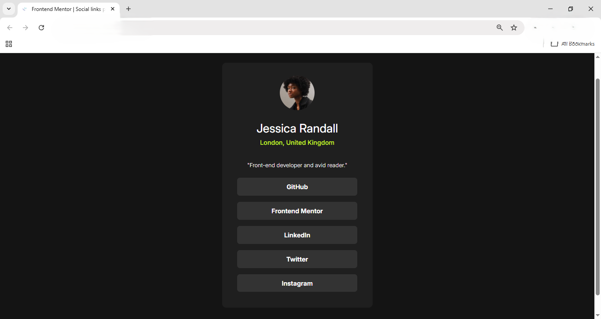

# Frontend Mentor - Social links profile solution 👥💬📱


## Challenge Overview

The challenge was to create a social links profile page that is fully responsive and looks good on different screen sizes. A key part of the task was to implement clear hover and focus effects on all interactive elements to enhance usability and accessibility. I also personalized the project by adding some of my real social media links so visitors can easily connect with me.

### 📸Screenshot📸



### Links

- 🌐**Frontend Mentor** [Frontend Mentor Link] https://www.frontendmentor.io/solutions/built-a-responsive-social-profile-with-accessible-hover-effects-2BSWr_cguB
- 🔗 **Live Site:** [Live Link] https://zk-code-dev.github.io/social-links-profile-main/
- 📂 **GitHub Repo:** [GitHub Link] https://github.com/ZK-code-dev/social-links-profile-main


### Built with

- Semantic HTML5 markup  
- CSS custom properties  
- Flexbox    
### What I learned

In this project, I focused on improving the **semantic structure** of my HTML.  
I shifted from using only `<div>` tags to more meaningful elements like `<main>` and `<section>`, which describe the content better and make the code easier to read and maintain.

Key points:

- The `<section>` tag gives semantic meaning, grouping related content.  
- The `<div>` tag is now mainly for layout, not meaning.  
- Built the page with a clean hierarchy:
  1. Profile image  
  2. Name, location, short bio  
  3. Social links list with `<ul>`, `<li>`, and `<a>`  
- Used `target="_blank"` on links to open in new tabs for better UX.  
- Used CSS Flexbox to center and align content neatly.  
- Discovered and applied the CSS `transition` property for smooth hover effects:
  ```css
  a:hover {
    transition: 0.2s ease-in;
  }
